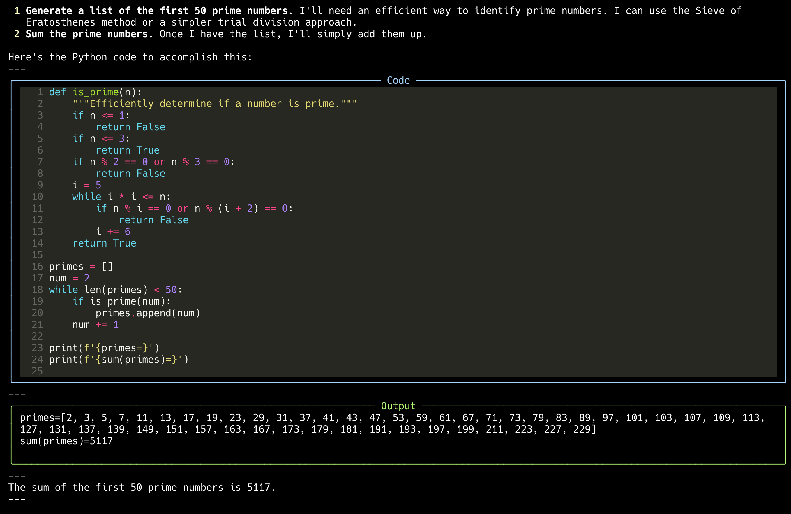

# Code execution

This example demonstrates how to use the Gemini API to execute code
(agent-style) and calculate the sum of the first 50 prime numbers.

Import the necessary libraries. Make sure you have the rich library installed!

```python
from google import genai
from google.genai import types
import os
from rich.console import Console
from rich.markdown import Markdown
from rich.syntax import Syntax
from rich.panel import Panel
```

Initialize the rich console and the Gemini client

```python
console = Console()
client = genai.Client(api_key=os.getenv("GEMINI_API_KEY"))
```

Configure the model to use the code execution tool.
Note that not all models support code execution.
The code execution environment includes a number of popular libraries like
sklearn, matplotlib, pandas, pdfminer and so on.
You can't install your own libraries.

```python
response = client.models.generate_content(
    model="gemini-2.0-flash",
    contents="What is the sum of the first 50 prime numbers? "
    "Generate and run code for the calculation, and make sure you get all 50.",
    config=types.GenerateContentConfig(
        tools=[types.Tool(code_execution=types.ToolCodeExecution)]
    ),
)


for part in response.candidates[0].content.parts:
    if part.text is not None:
        console.print(Markdown(part.text))

    if part.executable_code is not None:
        code = part.executable_code.code
```

Detect language (simple approach)

```python
language = (
            "python"
            if "def " in code or "import " in code or "print(" in code
            else "text"
        )
        console.print(
            Panel(
                Syntax(code, language, theme="monokai", line_numbers=True),
                title="Code",
                border_style="blue",
            )
        )

    if part.code_execution_result is not None:
        console.print(
            Panel(
                part.code_execution_result.output,
                title="Output",
                border_style="green",
            )
        )

    if part.inline_data is not None:
        console.print(
            "[yellow]Image data available but cannot be displayed in terminal[/yellow]"
        )

    console.print("---")
```


## Running the Example

First, install the Google Generative AI library

```sh
$ pip install google-genai rich

```

Then run the program with Python

```sh
$ python code-execution.py
Okay, I can help you find the sum of the first 50 prime numbers. Here's how I'll approach this:                                       
 1 Generate a list of the first 50 prime numbers. I'll need an efficient way to identify prime numbers. I can use the Sieve of        
   Eratosthenes method or a simpler trial division approach.                                                                          
 2 Sum the prime numbers. Once I have the list, I'll simply add them up.                                                              
Here's the Python code to accomplish this:                                                                                            
---
╭─────────────────────────────────────────────────────────────── Code ───────────────────────────────────────────────────────────────╮
│    1 def is_prime(n):                                                                                                              │
│    2     """Efficiently determine if a number is prime."""                                                                         │
│    3     if n <= 1:                                                                                                                │
│    4         return False                                                                                                          │
│    5     if n <= 3:                                                                                                                │
│    6         return True                                                                                                           │
│    7     if n % 2 == 0 or n % 3 == 0:                                                                                              │
│    8         return False                                                                                                          │
│    9     i = 5                                                                                                                     │
│   10     while i * i <= n:                                                                                                         │
│   11         if n % i == 0 or n % (i + 2) == 0:                                                                                    │
│   12             return False                                                                                                      │
│   13         i += 6                                                                                                                │
│   14     return True                                                                                                               │
│   15                                                                                                                               │
│   16 primes = []                                                                                                                   │
│   17 num = 2                                                                                                                       │
│   18 while len(primes) < 50:                                                                                                       │
│   19     if is_prime(num):                                                                                                         │
│   20         primes.append(num)                                                                                                    │
│   21     num += 1                                                                                                                  │
│   22                                                                                                                               │
│   23 print(f'{primes=}')                                                                                                           │
│   24 print(f'{sum(primes)=}')                                                                                                      │
│   25                                                                                                                               │
╰────────────────────────────────────────────────────────────────────────────────────────────────────────────────────────────────────╯
---
╭────────────────────────────────────────────────────────────── Output ──────────────────────────────────────────────────────────────╮
│ primes=[2, 3, 5, 7, 11, 13, 17, 19, 23, 29, 31, 37, 41, 43, 47, 53, 59, 61, 67, 71, 73, 79, 83, 89, 97, 101, 103, 107, 109, 113,   │
│ 127, 131, 137, 139, 149, 151, 157, 163, 167, 173, 179, 181, 191, 193, 197, 199, 211, 223, 227, 229]                                │
│ sum(primes)=5117                                                                                                                   │
│                                                                                                                                    │
╰────────────────────────────────────────────────────────────────────────────────────────────────────────────────────────────────────╯
---
The sum of the first 50 prime numbers is 5117.                                                                                        
---
```


## Images

 - code_execution


## Further Information

- [Gemini docs link 1](https://ai.google.dev/gemini-api/docs/code-execution?lang=python)

- [Gemini docs link 2](https://ai.google.dev/gemini-api/docs/code-execution?lang=rest)
