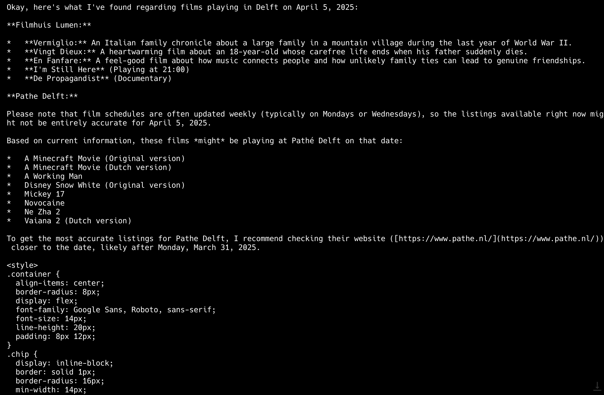

# Grounded responses with search tool

This example demonstrates how to use the Gemini API with the Search tool to
get grounded responses.
This means that you can ask questions to the LLM which will incorporate live
or dynamic search results into the response.

Import the Gemini API and necessary tools

```python
from google import genai
from google.genai.types import Tool, GenerateContentConfig, GoogleSearch
import os
```

Initialize the Gemini client with your API key

```python
client = genai.Client(api_key=os.getenv("GEMINI_API_KEY"))
```

Specify the model to use (Gemini 2.0 models or later support search as a tool)

```python
model_id = "gemini-2.0-flash"
```

Configure the Google Search tool

```python
google_search_tool = Tool(google_search=GoogleSearch())
```

Craft your query.  This one asks for films in Delft cinemas on a specific date.

```python
query = "What films are showing in Delft on April 5, 2025, particularly at Filmhuis Lumen and Pathe cinemas?"
```

Call the API to generate content, including the search tool in the configuration

```python
response = client.models.generate_content(
    model=model_id,
    contents=query,
    config=GenerateContentConfig(
        tools=[google_search_tool],
        response_modalities=["TEXT"],
    ),
)
```

Print the generated text response

```python
for each in response.candidates[0].content.parts:
    print(each.text)
```

(Optional) Print the grounding metadata (web content used to ground the response).
You'll get a lot of HTML data and content when you print this.

```python
print(response.candidates[0].grounding_metadata.search_entry_point.rendered_content)
```


## Running the Example

First, install the Google Generative AI library

```sh
$ pip install google-genai

```

Then run the program with Python

```sh
$ python grounded_search.py
[Example output - this will vary based on search results]
Okay, here's what I've found regarding films playing in Delft on April 5, 2025:
**Filmhuis Lumen:**
*   **Vermiglio:** An Italian family chronicle about a large family in a mountain village during the last year of World War II.
*   **Vingt Dieux:** A heartwarming film about an 18-year-old whose carefree life ends when his father suddenly dies.
*   **En Fanfare:** A feel-good film about how music connects people and how unlikely family ties can lead to genuine friendships.
*   **I'm Still Here** (Playing at 21:00)
*   **De Propagandist** (Documentary)
**Pathe Delft:**
Please note that film schedules are often updated weekly (typically on Mondays or Wednesdays), so the listings available right now might not be entirely accurate for April 5, 2025.
Based on current information, these films *might* be playing at Pathé Delft on that date:
*   A Minecraft Movie (Original version)
*   A Minecraft Movie (Dutch version)
*   A Working Man
*   Disney Snow White (Original version)
*   Mickey 17
*   Novocaine
*   Ne Zha 2
*   Vaiana 2 (Dutch version)
To get the most accurate listings for Pathe Delft, I recommend checking their website ([https://www.pathe.nl/](https://www.pathe.nl/)) closer to the date, likely after Monday, March 31, 2025.
<style>
.container {
  align-items: center;
  border-radius: 8px;
  display: flex;
  font-family: Google Sans, Roboto, sans-serif;
  font-size: 14px;
  line-height: 20px;
  padding: 8px 12px;
}
.chip {
  display: inline-block;
  border: solid 1px;
  border-radius: 16px;
  min-width: 14px;
etc...
```


## Images

 - Responses


## Further Information

- [Gemini docs link 1](https://ai.google.dev/gemini-api/docs/grounding?lang=python)
