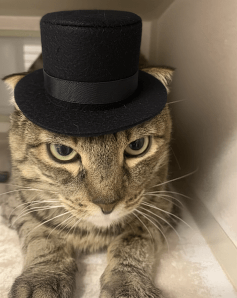

# Edit an image

This example demonstrates how to edit an existing image of a cat to add a hat using the Gemini API.

Import necessary libraries. Make sure Pillow is installed!

```python
from google import genai
from google.genai import types
from PIL import Image
import requests
from io import BytesIO
import os
```

Set your Gemini API key

```python
client = genai.Client(api_key=os.getenv("GEMINI_API_KEY"))
```

Download the cat image from cataas.com

```python
image_url = "https://cataas.com/cat"
response = requests.get(image_url)
cat_image = Image.open(BytesIO(response.content))
```

Prepare a prompt.

```python
text_prompt = "Please add a stylish top hat to this cat."
```

Generate content with the Gemini API

```python
model = "gemini-2.0-flash-exp-image-generation"
response = client.models.generate_content(
    model=model,
    contents=[text_prompt, cat_image],
    config=types.GenerateContentConfig(response_modalities=["Text", "Image"]),
)
```

Process the response. Retry if you get a 500 error.

```python
for part in response.candidates[0].content.parts:
    if part.text is not None:
        print(part.text)
    elif part.inline_data is not None:
        print(f"Received {part.inline_data.mime_type} data")
```

The data is provided as raw bytes, not base64-encoded

```python
image = Image.open(BytesIO(part.inline_data.data))
        image.save("cat_with_hat.png")
        print("\nImage saved as cat_with_hat.png")
```


## Running the Example

First, install the Google Generative AI library

```sh
$ pip install google-genai Pillow requests

```

Then run the program with Python

```sh
$ python edit_cat.py
Image saved as cat_with_hat.png
```


## Images

 - cat_with_hat


## Further Information

- [Gemini docs link 1](https://ai.google.dev/gemini-api/docs/image-generation#gemini-image-editing)
