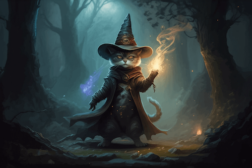

# Image generation (Gemini and Imagen)

This example demonstrates generating images using both Gemini 2.0 Flash and Imagen 3 models, focusing on cat-related prompts.

Import necessary libraries. Make sure Pillow is installed!

```python
from google import genai
from google.genai import types
from PIL import Image
from io import BytesIO
```

Initialize the Gemini client with your API key

```python
client = genai.Client(api_key="YOUR_API_KEY")
```

We start by using Gemini 2.0 Flash for image generation.
Demonstrates generating an image and associated text using Gemini 2.0 Flash.

```python
contents = (
    "Hi, can you create a 3D rendered image of a cat wearing a wizard hat, "
    "casting a spell in a magical forest?"
)

response = client.models.generate_content(
    model="gemini-2.0-flash-exp-image-generation",
    contents=contents,
    config=types.GenerateContentConfig(response_modalities=["Text", "Image"]),
)
```

Save the image to a file and display it

```python
for part in response.candidates[0].content.parts:
    if part.text is not None:
        print(part.text)
    elif part.inline_data is not None:
        image = Image.open(BytesIO(part.inline_data.data))
        image.save("gemini-cat-wizard.png")
        image.show()
```

Now we use Imagen 3 for image generation.
Demonstrates generating multiple high-quality images of cats using Imagen 3.
Imagen 3 is only available on the Paid Tier and always includes a SynthID watermark.

```python
response = client.models.generate_images(
    model="imagen-3.0-generate-002",
    prompt="A photorealistic image of a cat astronaut floating in space",
    config=types.GenerateImagesConfig(number_of_images=2),
)
```

Save the images to files and display them

```python
for i, generated_image in enumerate(response.generated_images):
    image = Image.open(BytesIO(generated_image.image.image_bytes))
    image.save(f"imagen-cat-astronaut-{i+1}.png")
    image.show()
```


## Running the Example

First, install the Google Generative AI library

```sh
$ pip install google-genai Pillow

```

Then run the program with Python

```sh
$ python image-generation.py
# Expected output (will vary based on the model):
# (Text describing the cat wizard image from Gemini 2.0 Flash)
# (Two image windows will open, displaying the generated cat astronaut images from Imagen 3)
# Image saved as gemini-cat-wizard.png
# (Two image windows will open, displaying the generated cat astronaut images from Imagen 3)
```


## Images

 - Wizard


## Further Information

- [Gemini docs link 1](https://ai.google.dev/gemini-api/docs/image-generation)
