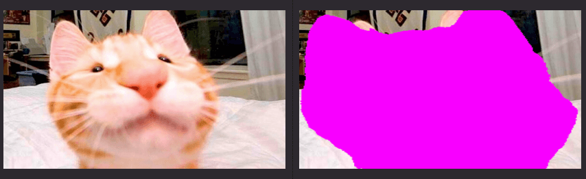

# Image segmentation

This example demonstrates how to use the Gemini API to perform image segmentation on a picture of a cat.

Import the Gemini API and necessary libraries. Make sure Pillow is installed!

```python
from google import genai
import os
import requests
from PIL import Image
from io import BytesIO
import json
import base64
```

Initialize the Gemini client with your API key

```python
client = genai.Client(api_key=os.getenv("GEMINI_API_KEY"))
```

Define the prompt for image segmentation, focusing on cats

```python
prompt = """
Give the segmentation masks for the cat in the image.
Output a JSON list of segmentation masks where each entry contains the 2D
bounding box in the key \"box_2d\", the segmentation mask in key \"mask\", and
the text label in the key \"label\". Use descriptive labels.
"""
```

Download the cat image from cataas.com

```python
image_url = "https://cataas.com/cat"
response = requests.get(image_url)
cat_image = Image.open(BytesIO(response.content))
```

Save the original image

```python
original_filename = f"cat_original.png"
cat_image.save(original_filename)
print(f"Original image saved as: {original_filename}")
```

Call the Gemini API to generate content with the image and prompt

```python
response = client.models.generate_content(
    model="gemini-2.5-pro-exp-03-25", contents=[cat_image, prompt]
)
```

Print the response containing segmentation information.

```python
print(response.text)
```

Display and save the overlaid mask.
Extract the JSON part from the response (it might be wrapped in markdown)

```python
response_text = response.text
if "```json" in response_text:
    json_str = response_text.split("```json")[1].split("```")[0].strip()
elif "[" in response_text and "]" in response_text:
    start = response_text.find("[")
    end = response_text.rfind("]") + 1
    json_str = response_text[start:end]
else:
    json_str = response_text
```

Parse JSON data

```python
mask_data = json.loads(json_str)
```

Get the first mask. This assumes a mask was returned.

```python
first_mask = mask_data[0]
```

Extract base64 encoded mask

```python
mask_base64 = first_mask.get("mask", "")
if "base64," in mask_base64:
    mask_base64 = mask_base64.split("base64,")[1]
```

Decode and load the mask image

```python
mask_bytes = base64.b64decode(mask_base64)
mask_image = Image.open(BytesIO(mask_bytes))
```

Convert images to RGBA

```python
cat_image = cat_image.convert("RGBA")
mask_image = mask_image.convert("L")  # Convert mask to grayscale
```

Create a bright colored overlay (bright pink)

```python
overlay = Image.new(
    "RGBA", mask_image.size, (255, 0, 255, 128)
)  # Bright pink, semi-transparent
```

Use the mask to determine where to apply the color.
We need the mask as an alpha channel

```python
overlay.putalpha(mask_image)
```

Resize the overlay to match the original image if needed

```python
if overlay.size != cat_image.size:
    overlay = overlay.resize(cat_image.size)
```

Overlay the colored mask on the original image. Save both images.

```python
result = Image.alpha_composite(cat_image, overlay)

mask_filename = f"cat_mask.png"
mask_image.save(mask_filename)

merged_filename = f"cat_with_mask.png"
result.save(merged_filename)
```


## Running the Example

First, install the Google Generative AI library

```sh
$ pip install google-genai

```

Then run the program with Python

```sh
$ python cat_segmentation.py
# Expected output (example):
# [{"box_2d": [100, 50, 900, 750], "mask": "base64_encoded_png_data", "label": "Main Coon Cat"}, ...]
```


## Images

 - Segmentation


## Further Information

- [Gemini docs link 1](https://ai.google.dev/gemini-api/docs/vision?lang=python#image_segmentation)
