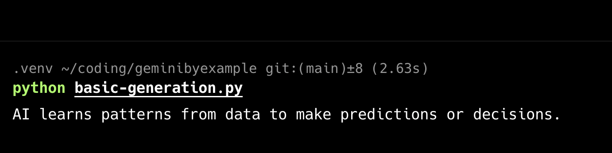

# Simple text generation

Our first example demonstrates how to use the Gemini API
to generate content with a simple prompt.

```python
from google import genai
```

Best practice: store your API key in an environment variable
and load it from there.

```python
client = genai.Client(api_key="YOUR_API_KEY")

response = client.models.generate_content(
    model="gemini-2.0-flash", contents="Explain how AI works in a few words"
)
print(response.text)
```


## Running the Example

First, install the Google Generative AI library

```sh
$ pip install google-genai

```

Then run the program with Python

```sh
$ python basic-generation.py
AI works by learning patterns from data, then using those patterns to make predictions or generate new content. It processes information through neural networks that mimic human brain connections, identifying features and relationships to perform tasks like recognition, prediction, and generation.
```


## Images

 - Generation


## Further Information

- [Gemini docs link 1](https://ai.google.dev/gemini-api/docs/text-generation)
